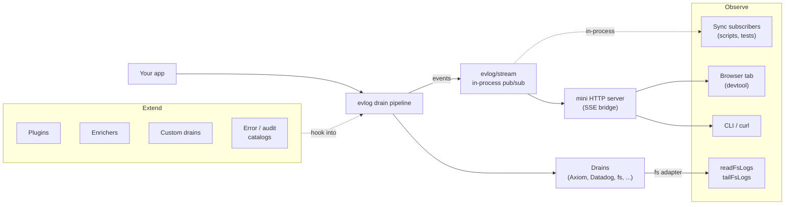

evlog is designed to be extensible from both ends. There are **two distinct angles** to "build on top" — and they answer different questions:

::callout
---
icon: i-lucide-eye
---
**Observe** — *I want to read what flows through the pipeline.*

Plug a subscriber into evlog and react to wide events live: a devtool, a dashboard, a CLI tail, an analytics console. The events come from your app, you decide what to do with them.
::

::callout
---
icon: i-lucide-plug
---
**Extend** — *I want to plug something into the pipeline.*

Add custom logic that runs as events flow through evlog itself: enrichers, drains, plugins, error/audit catalogs you can publish as packages. Your code is part of the pipeline.
::

## Observe — pages here

| | What | When you want it |
| --- | --- | --- |
| [Stream API](/build-on-top/stream-api) | `createStreamDrain()`, `getDefaultStream()` — in-process subscribe / iterate | A consumer lives in the same Node process as your app |
| [Stream server](/build-on-top/stream-server) | Mini HTTP server on its own port that exposes the stream over SSE | A browser tab, a CLI, an external devtool needs to subscribe |
| [Reading FS logs](/build-on-top/fs-reader) | `readFsLogs()` / `tailFsLogs()` — replay or follow the NDJSON drain | You want history (replay yesterday's errors, post-incident triage) |
| [Identity headers](/build-on-top/identity-headers) | `User-Agent: evlog/<version>` + `X-Evlog-Source` on every drain request | You want receivers (Axiom, Datadog…) to identify evlog traffic |
| [Recipes](/build-on-top/recipes) | Copy-paste patterns: build a devtool, curl + jq, replay-then-live, aggregate | You want a starting point |

## Extend — where the docs live

These surfaces existed before this section — links into their canonical pages:

| | What | Doc |
| --- | --- | --- |
| **Plugins** | `definePlugin()` — opt into any subset of evlog's lifecycle hooks | [Custom adapter / plugin](/adapters/building-blocks/custom) |
| **Custom drains** | `defineDrain()` / `defineHttpDrain()` — ship events anywhere | [Building blocks: pipeline](/adapters/building-blocks/pipeline), [HTTP drain](/adapters/building-blocks/http) |
| **Custom enrichers** | `defineEnricher()` — derive context (geo, deploy id, tenant…) | [Custom enrichers](/enrichers/custom) |
| **Error catalogs** | `defineErrorCatalog()` — typed error factories with module-augmentation | [Catalogs](/logging/catalogs) |
| **Audit catalogs** | `defineAuditCatalog()` — typed audit actions | [Audit overview](/logging/audit/overview) |
| **Framework integrations** | `createMiddlewareLogger()` + helpers — bring evlog to any HTTP framework | [Custom integration](/frameworks/custom-integration) |
| **Catalogs as packages** | Publish a catalog as a reusable npm package (Stripe errors, AWS audit…) | [Catalogs as packages](/build-on-top/catalogs-as-packages) |

## A note on serverless

Both observe-side network features (the [stream server](/build-on-top/stream-server) for live subscription, the in-process [stream](/build-on-top/stream-api) primitive) work everywhere a Node-like long-lived process runs — local dev, self-hosted servers, containers (Fly, Railway, Coolify), VMs.

They do **not** work on serverless platforms (Vercel Functions, Cloudflare Workers, AWS Lambda) because each invocation is an isolated process. Use a real broker (Redis Streams, NATS, Pub/Sub) for cross-instance fan-out in those environments.

The fs reader, identity headers, and the entire **Extend** axis work everywhere — they are not bound to a long-lived process.
